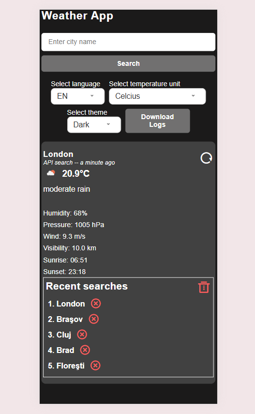

# Weather App 🌦️

Discover Weather App – your smart weather app, powered by OpenWeather!
Get detailed information about temperature, humidity, wind, UV index and more – all in one modern, fast and reliable app!
Turn every day into a surprise-free experience with Weather App – the weather exactly the way you want it!

[Demo Live](https://cosminneaga.github.io/weather-app/)
[Source Code](https://github.com/cosminneaga/weather-app)

> A weather application built with Vanilla JavaScript as part of the JavaScript Full Track course at [Generatia Tech](https://generatiatech.ro/)

## 🚀 Features

- [x] Show weather information from OpenWeather API
- [x] Theme dark/light
- [x] Language english/romanian
- [x] Selector for measurement units, Celsius, Fahrenheit or Kelvin
- [x] Persistence of history and logs in localStorage
- [x] Possibility to download system logs to a 'txt' file
- [x] Advanced caching methodology to avoid API abuse, also refreshing data by avoiding caching if needed
- [x] Load city data by coordinates on page load

# 🛠️ Tech Stack

## Frontend

- **Vanilla Javascript (ES6+)** - Modular architecture
- - dayjs
- - remixicons
- **CSS3** - Responsive design
- **HTML5** - Semantic structure

## API & Services

- **OpenWeatherMap API** - Real-time weather data
- **Geolocation API** - Automatic location detection
- **IP Geolocation API** - Automatic location detection fallback

## Tools & Workflow

- **Git/GitHub** - CI pipeline & collaboration
- **VSCode** - Development environment
- **GitHub Pages** - Free hosting

# 📦 Install & Run

## 🚀 Requirements

- Modern browser (Chrome, Firefox, Safari, Edge)
- Free API key from OpenWeatherMap

## 📦 Local setup

- Download the app using the following git command: `git clone https://github.com/cosminneaga/weather-app.git`
- Open in VSCode
- Install VSCode extension LiveServer [https://marketplace.visualstudio.com/items?itemName=ritwickdey.LiveServer](https://marketplace.visualstudio.com/items?itemName=ritwickdey.LiveServer)
- Right click on `index.html`
- Click on menu option `Open with LiverServer`
- Visualise in your browser at [http://localhost:5500/index.html](http://localhost:5500/index.html)

Edit `modules/config.js` and add your own API key in `CONFIG.API_KEY`

## 🚀 Demo și Screenshots

- Theme
- - Dark mode

- - Light mode

- Language
- - English

- - Romanian

- Units
- - Celcius

- - Fahrenheit

- - Kelvin

- Responsiveness
- - Portrait
 
- - Landscape

# 🗺️ Roadmap

- [x] Part 1: Fundamente
- [x] Part 2: API real
- [x] Part 3 Logging System, localStorage, weather by location, error handling
- [x] Part 4 Caching system, GitHub hosting

# 👨‍💻 Author

Cosmin Neaga
